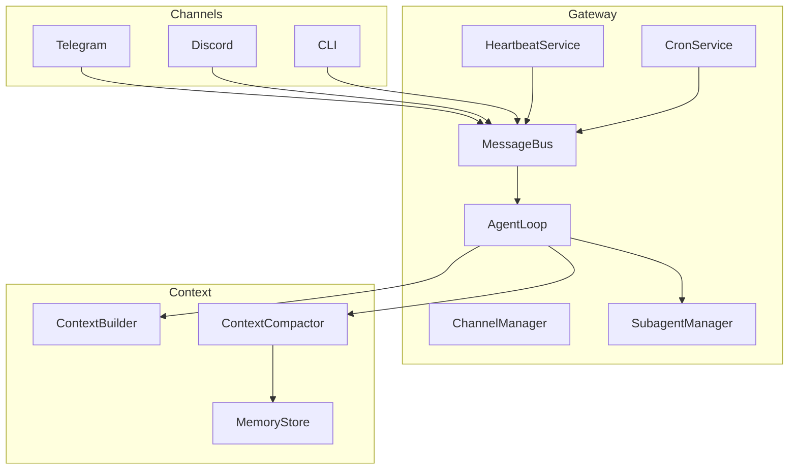

# Features Overview

This page introduces the core capabilities of weavbot: models, channels, tools, subagents, heartbeat, cron, MCP, skills, context compaction, and long-term memory.

## Models

Models are string identifiers (e.g. `anthropic/claude-opus-4-5`, `claude-sonnet-4-20250514`). Configure them in `agents.defaults.model` and `providers`.

- **Multi-provider support** — Anthropic, OpenAI, OpenRouter, DeepSeek, and any OpenAI-compatible API
- **Provider modes** — `openai` (default) or `anthropic` for native Anthropic API
- **Reasoning** — set `reasoningEffort` to `low`, `medium`, or `high` for extended thinking

See [Configuration]({{ site.baseurl }}/en/configuration/) for `providers` and `agents.defaults` options.

## Channels

Channels connect the agent to external chat platforms. The flow: **channel** → `bus.publish_inbound()` → **Agent** → `bus.publish_outbound()` → `ChannelManager._dispatch_outbound()` → **channel** `send()`.

- **Supported channels** — Telegram, Discord, Feishu, DingTalk, Slack, QQ, Wecom, Email, Mochat
- **BaseChannel** — abstract interface: `start`, `stop`, `send`, `_handle_message`
- **Options** — `allowFrom`, proxy, streaming progress, tool hints

**Chat commands** — Slash commands work in any channel (CLI, Telegram, etc.): `/new` (start a new conversation; archive memory first, then clear session), `/stop` (stop the current task and subagents), `/help` (show commands).

## Tools

Tools are capabilities the agent invokes via function calls. Each tool implements `name`, `description`, `parameters` (JSON Schema), and `execute()`.

- **ToolRegistry** — registers tools, executes calls, exports OpenAI-format schemas
- **Built-in tools** — `read_file`, `write_file`, `edit_file`, `list_dir`, `glob_file`, `grep_file`, `shell`, `load_media`, `web_fetch`, `message`, `spawn`, `cron` (plus MCP tools)
- **Config** — `tools.exec.timeout`, `tools.exec.pathAppend`, `tools.web.proxy`, `tools.restrictToWorkspace`
- **Scoping** — main agent has the full set; subagents use a restricted subset

## Subagent

The main agent can spawn background subagents to run long-running tasks via the `spawn` tool.

- **Execution** — in-process asyncio tasks, not separate OS processes (not visible via `ps` or `top`)
- **Subagent tools** — file tools (read/write/edit/list_dir/glob/grep), `shell`, `load_media`, `web_fetch`; **excludes** `message`, `spawn`, `cron`
- **Result delivery** — on completion, the subagent posts a result summary to the main agent's session via the message bus
- **Cancellation** — `/new` and similar commands cancel all subagents for that session

## Heartbeat

The heartbeat service periodically checks `workspace/HEARTBEAT.md` and optionally runs tasks.

1. **Phase 1** — every `intervalS` (default 1800s), read `HEARTBEAT.md` and ask the LLM whether to `skip` or `run`
2. **Phase 2** — if `run`, run the agent with the task and deliver the response via `on_notify`

Config: `gateway.heartbeat.enabled`, `gateway.heartbeat.intervalS`.

## Cron

Scheduled agent runs. Jobs are stored in `workspace/cron/jobs.json`.

- **Schedule types** — `at` (one-time), `every` (interval), `cron` (cron expression, with timezone)
- **Cron tool** — agent adds/removes jobs with `add`, `list`, `remove`
- **Execution** — `CronService` triggers the agent when jobs are due

## MCP

Model Context Protocol (MCP) servers extend the agent with external tools.

- **Connection** — stdio (`command`, `args`, `env`) or HTTP (`url`, `headers`)
- **Tool names** — `mcp_{server}_{tool_name}`
- **Config** — `tools.mcpServers`; optional `toolTimeout`, `disabledTools`, `enabledTools`

MCP servers connect lazily on the first message.

## Skills

Skills provide domain knowledge via `{name}/SKILL.md` in `workspace/skills/` or built-in `weavbot/skills/`.

- **Frontmatter** — `name`, `description`, `always`, `requires.bins`, `requires.env`
- **Injection** — `always` skills are inlined into the system prompt; others are summarized for on-demand loading
- **Built-in** — cron, memory

## Context Compaction

When the conversation exceeds the context budget (`estimate_tokens + max_output_tokens > max_context`):

1. **Memory consolidation** — `_consolidate_memory()` updates long-term memory from older turns
2. **Summarization** — LLM summarizes history into a compact seed message `[Context Compact Summary]\n\n{summary}`
3. **Session cursor** — `context_compacted_cursor` advances; older turns are replaced by the summary
4. **Runtime fallback** — if still too large, `shrink_messages_for_runtime()` drops oldest turns or keeps only system + latest user

## Long-term Memory

Two-layer storage:

- **MEMORY.md** — persistent facts; injected into the system prompt via `get_memory_context()`
- **memory/YYYY-MM-DD.md** — daily logs; agent uses `grep_file(path="memory")` to search when needed

**Consolidation** — LLM extracts `daily_log_entry` and `long_term_memory` from history and calls `save_memory`. Triggered during context compaction and when the user sends `/new` (archive before clear).

[Configuration]({{ site.baseurl }}/en/configuration/) | [Quick Start]({{ site.baseurl }}/en/quick-start/)
