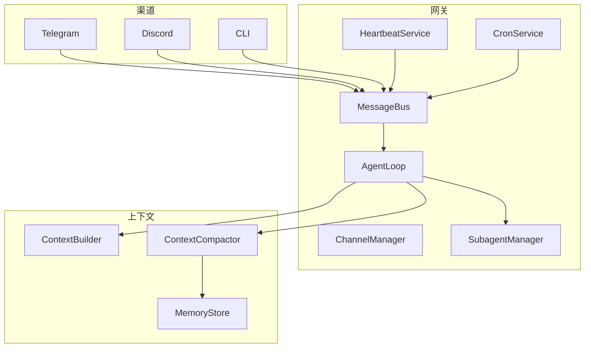

# 功能概览

本文介绍 weavbot 的核心能力：模型、渠道、工具、子代理、心跳、定时任务、MCP、技能、基于 context 的自动压缩与长期内存管理。

## 模型

模型为字符串标识（如 `anthropic/claude-opus-4-5`、`claude-sonnet-4-20250514`），在 `agents.defaults.model` 和 `providers` 中配置。

- **多服务商** — Anthropic、OpenAI、OpenRouter、DeepSeek 及任意 OpenAI 兼容 API
- **Provider 模式** — `openai`（默认）或 `anthropic`（原生 Anthropic API）
- **思考模式** — 配置 `reasoningEffort` 为 `low`、`medium` 或 `high` 启用扩展思考

详见[配置]({{ site.baseurl }}/zh/configuration/)中的 `providers` 与 `agents.defaults`。

## 渠道

渠道将代理与外部聊天平台连接。流程：**渠道** → `bus.publish_inbound()` → **Agent** → `bus.publish_outbound()` → `ChannelManager._dispatch_outbound()` → **渠道** `send()`。

- **已支持** — Telegram、Discord、飞书、钉钉、Slack、QQ、Email、Mochat
- **BaseChannel** — 抽象接口：`start`、`stop`、`send`、`_handle_message`
- **配置项** — `allowFrom`、代理、流式进度、工具调用提示

**聊天命令** — 斜杠命令在任意渠道（CLI、Telegram 等）中可用：`/new`（开始新对话，先归档记忆再清空会话）、`/stop`（停止当前任务及子代理）、`/help`（显示命令说明）。

## 工具

工具是代理通过 function call 调用的能力，每个工具实现 `name`、`description`、`parameters`（JSON Schema）、`execute()`。

- **ToolRegistry** — 注册、执行、导出 OpenAI 格式 schema
- **内置工具** — `read_file`、`write_file`、`edit_file`、`list_dir`、`glob_file`、`grep_file`、`shell`、`load_media`、`web_fetch`、`message`、`spawn`、`cron`（另含 MCP 扩展）
- **配置** — `tools.exec.timeout`、`tools.exec.pathAppend`、`tools.web.proxy`、`tools.restrictToWorkspace`
- **作用域** — 主 Agent 拥有完整工具集；子代理使用受限子集

## 子代理

主 Agent 可通过 `spawn` 工具创建后台子代理，执行耗时任务。

- **运行方式** — 同进程内 asyncio 任务，非独立 OS 进程（无法用 ps/top 查看）
- **子代理工具** — 文件类（read/write/edit/list_dir/glob/grep）、`shell`、`load_media`、`web_fetch`；**不含** `message`、`spawn`、`cron`
- **结果回传** — 完成后通过消息总线向主 Agent 所在会话发送结果摘要
- **取消** — `/new` 等操作会取消该会话下所有子代理

## 心跳

心跳服务周期性读取 `workspace/HEARTBEAT.md`，并按需执行任务。

1. **阶段一** — 每 `intervalS`（默认 1800 秒）读取 `HEARTBEAT.md`，由 LLM 判断 `skip` 或 `run`
2. **阶段二** — 若为 `run`，则启动 Agent 执行任务，并通过 `on_notify` 下发结果

配置：`gateway.heartbeat.enabled`、`gateway.heartbeat.intervalS`。

## 定时任务

定时执行 Agent。任务存储在 `workspace/cron/jobs.json`。

- **调度类型** — `at`（一次性）、`every`（间隔）、`cron`（cron 表达式，支持时区）
- **cron 工具** — Agent 通过 `add`、`list`、`remove` 管理任务
- **执行** — 到期时由 `CronService` 触发 Agent

## MCP

Model Context Protocol 服务可扩展 Agent 工具能力。

- **连接方式** — stdio（`command`、`args`、`env`）或 HTTP（`url`、`headers`）
- **工具命名** — `mcp_{server}_{tool_name}`
- **配置** — `tools.mcpServers`；可选 `toolTimeout`、`disabledTools`、`enabledTools`

MCP 在首条消息时按需连接。

## 技能

技能通过 `workspace/skills/` 或内置 `weavbot/skills/` 下的 `{name}/SKILL.md` 提供领域知识。

- **Frontmatter** — `name`、`description`、`always`、`requires.bins`、`requires.env`
- **注入方式** — `always` 技能直接写入 system prompt；其它以摘要形式供按需加载
- **内置** — cron、memory

## 基于 Context 的自动压缩

当对话超出 context 预算（`estimate_tokens + max_output_tokens > max_context`）时：

1. **内存 consolidation** — `_consolidate_memory()` 将历史写入长期记忆
2. **摘要** — LLM 将历史压缩为 `[Context Compact Summary]\n\n{summary}` 种子消息
3. **游标** — `context_compacted_cursor` 前移，旧轮次被摘要替换
4. **运行时兜底** — 若仍超限，`shrink_messages_for_runtime()` 丢弃最旧轮次或只保留 system + 最近 user

## 长期内存管理

双层存储：

- **MEMORY.md** — 持久事实，通过 `get_memory_context()` 注入 system prompt
- **memory/YYYY-MM-DD.md** — 按日日志，Agent 通过 `grep_file(path="memory")` 按需检索

**consolidate** — LLM 从历史中提取 `daily_log_entry` 与 `long_term_memory` 并调用 `save_memory`。触发时机：context 压缩、用户发送 `/new`（归档后清空）。

[配置]({{ site.baseurl }}/zh/configuration/) | [快速开始]({{ site.baseurl }}/zh/quick-start/)
